# Devcode Starter using React Level 1

## Hasil Akhir yang Diharapkan

Peserta dapat menampilkan Halaman Hello yang berisi Logo Devcode dan Teks `I'm ready for the next challenge!`.

## Setup Environment

1. Download source code melalui link yang telah disediakan dari halaman assesment
2. Extract source code yang sudah terdownload pada perangkat anda
3. Buka source code yang sudah diextract menggunakan Code Editor, contoh Visual Studio Code
4. Jalankan `npm install` pada terminal
5. Jalankan `npm run start` pada terminal
6. Akses `localhost:3000` pada browser

## Instruksi Pengerjaan

1. Selesaikan semua TODO yang terdapat pada file `index.js`, `HelloWorld/index.js`
2. Buat online repository di Github (Jika belum memiliki akun Github, silahkan daftar [disini](https://github.com/signup))
3. Push project ke online repository yang sudah anda buat
4. Deploy project ini ke Hosting yang anda miliki atau bisa juga menggunakan layanan hosting gratis seperti Vercel (Jika belum memiliki akun Vercel, silahkan daftar [disini](https://vercel.com/signup))

## Teknologi yang Digunakan

1. [React](https://reactjs.org/)
2. [ReactDOM](https://reactjs.org/docs/react-dom.html)
3. [React Router](https://reactrouter.com/en/main/start/overview)
4. [React Testing Library](https://testing-library.com/docs/react-testing-library/intro/)
5. [Axios](https://axios-http.com/docs/intro)

## Langkah-langkah membuat repositori baru di Github

1. Klik tombol **New** yang terletak di bawah username pada bagian kiri halaman utama
   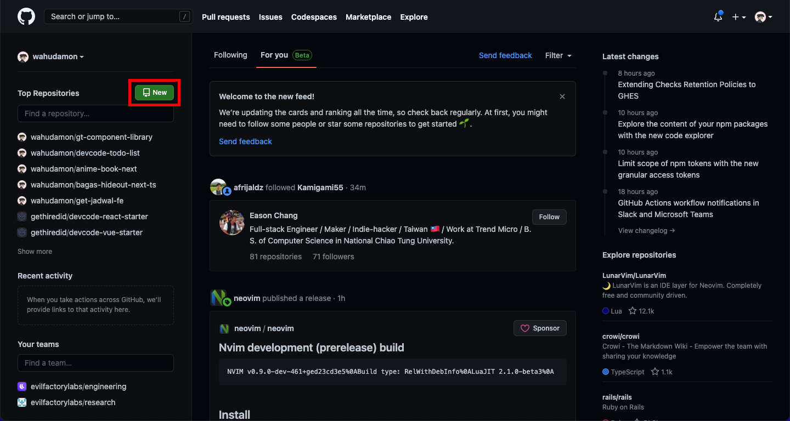
2. Juga bisa klik pada ikon **+** yang ada di sebelah ikon notifikasi pada pojok kanan atas halaman utama
   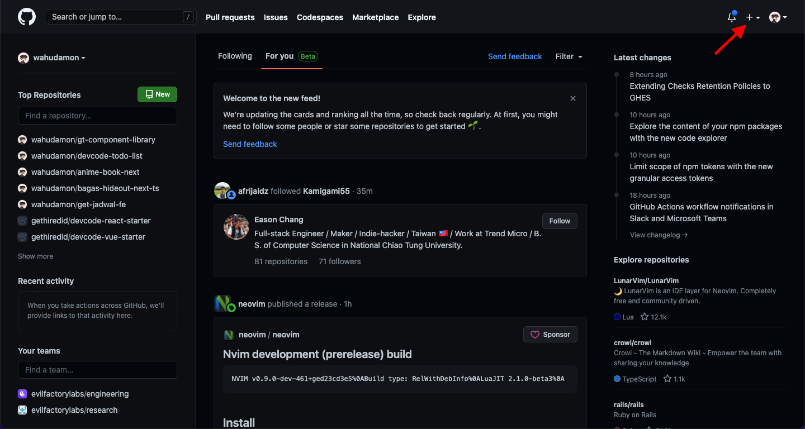
3. Jika klik ikon **+**, maka langkah selanjutnya adalah pilih opsi **New Repository**
   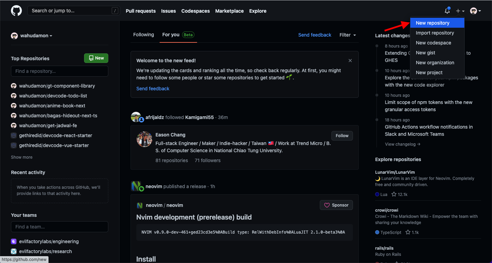
4. Selanjutnya isi kolom **Repository name** dengan nama repositori yang akan dibuat
   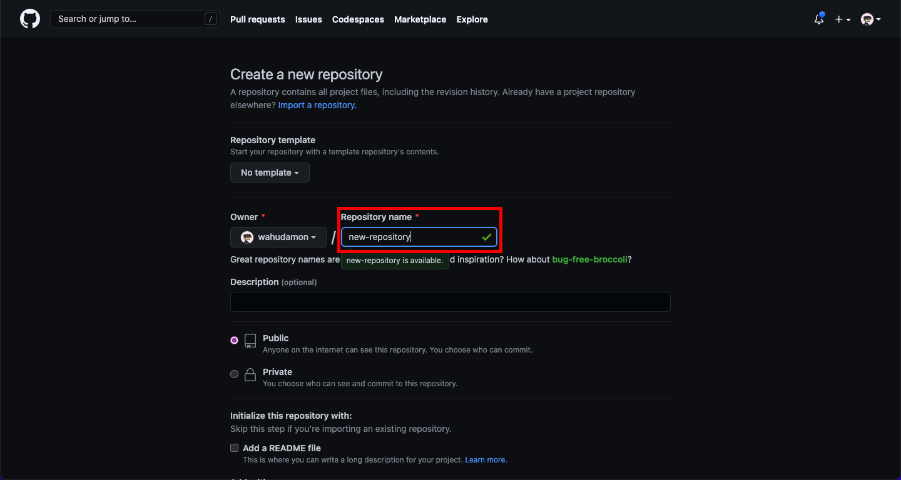
5. Tambahkan deskripsi repositori pada kolom **Description**, langkah ini opsional
   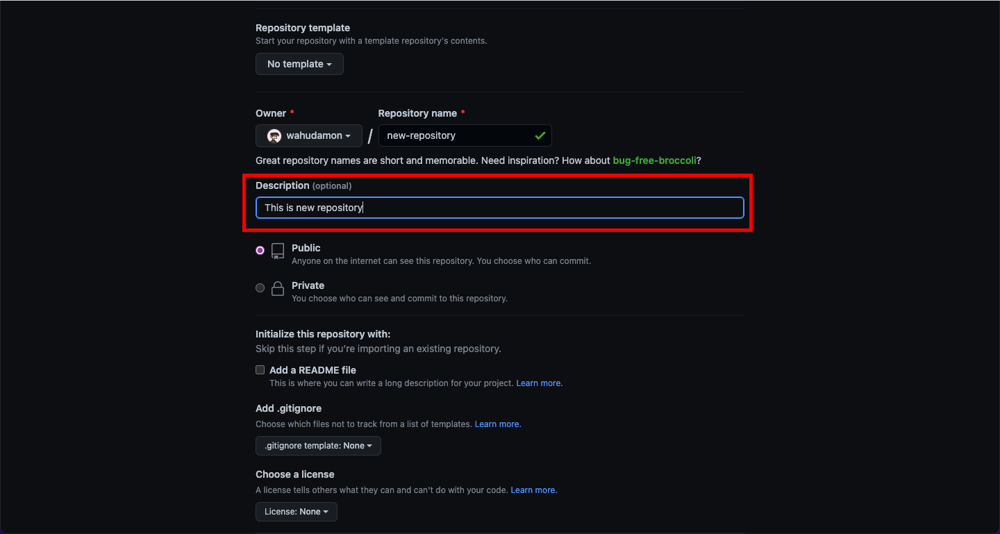
6. Setelah itu, pilih opsi **Public** di bawah kolom **Description**
   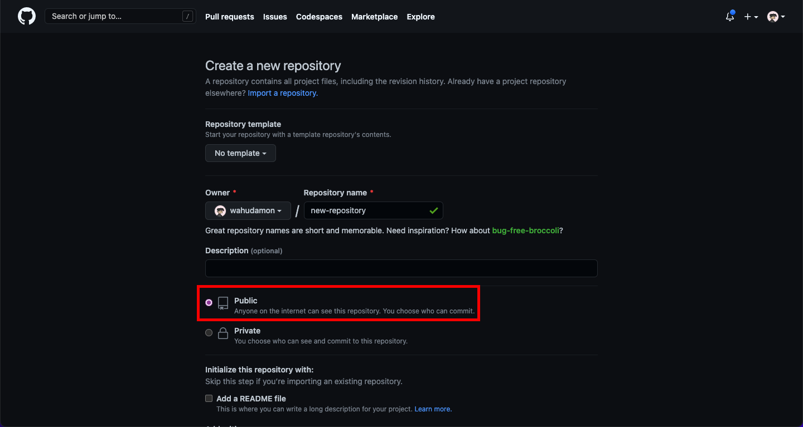
7. Klik tombol **Create Repository** untuk membuat repositori baru di Github
   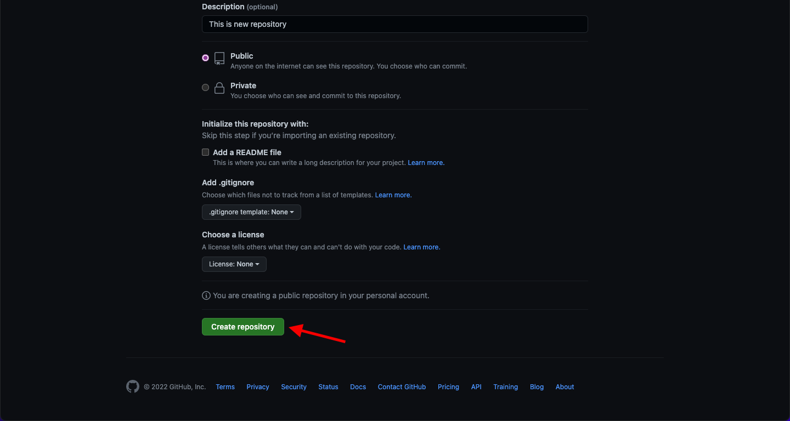
8. Setelah selesai, anda akan diarahkan ke halaman repo baru yang sudah dibuat sebelumnya. Silahkan ikuti langkah-langkah untuk clone repo yang sudah dibuat ke local anda
   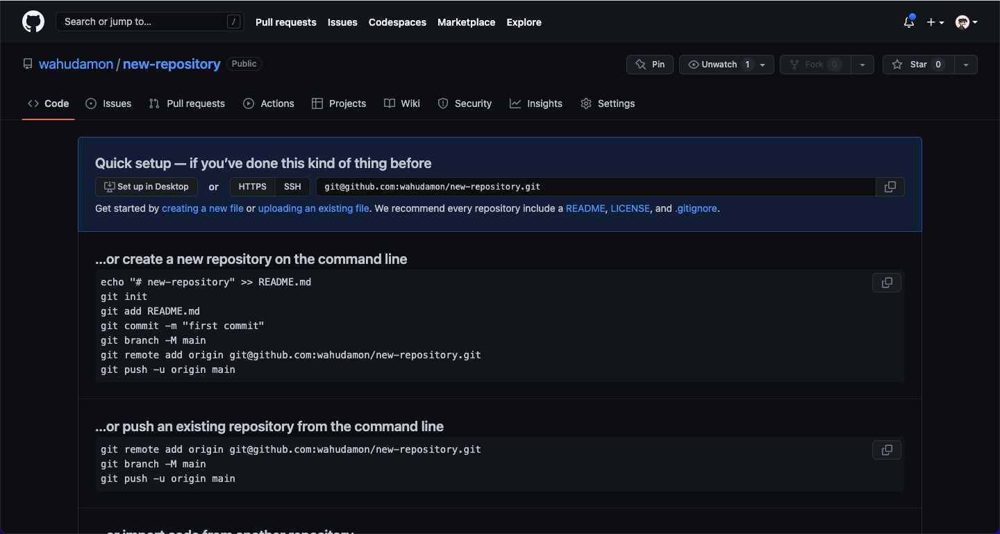

## Langkah-langkah Deploy menggunakan Vercel

1. Klik tombol **Add New...** pada halaman dashboard vercel
   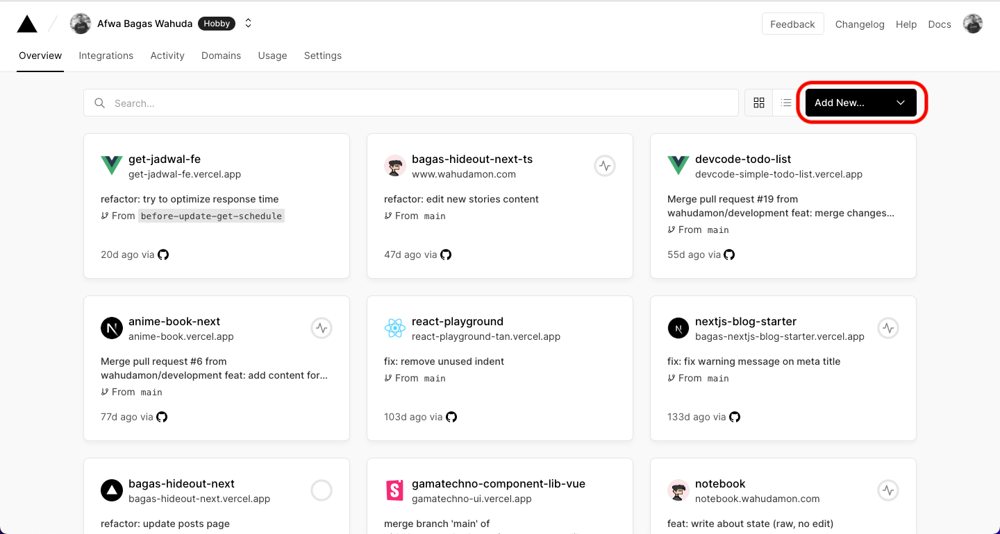
2. Pilih opsi **Project**
   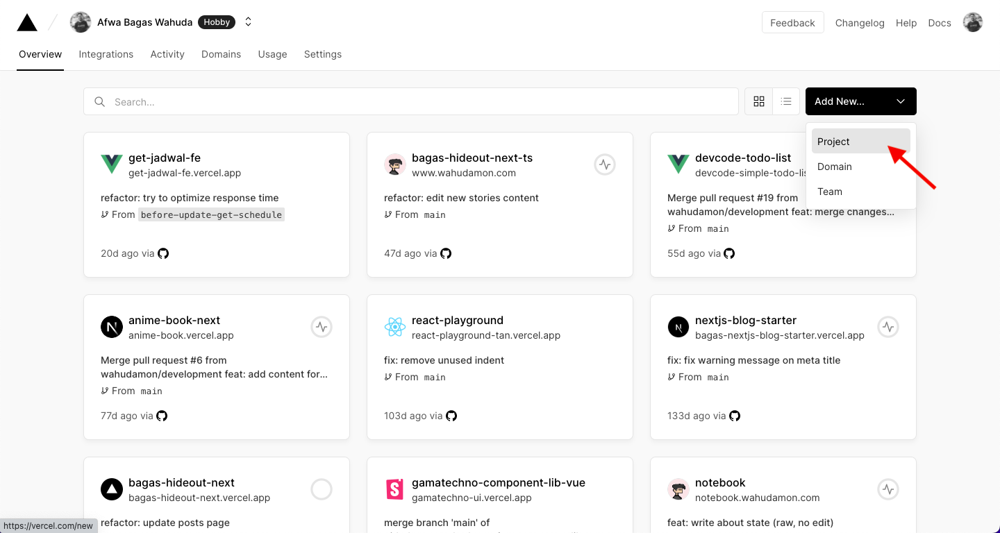
3. Pilih opsi **Continue with Github** pada bagian **Import Git Repository**
   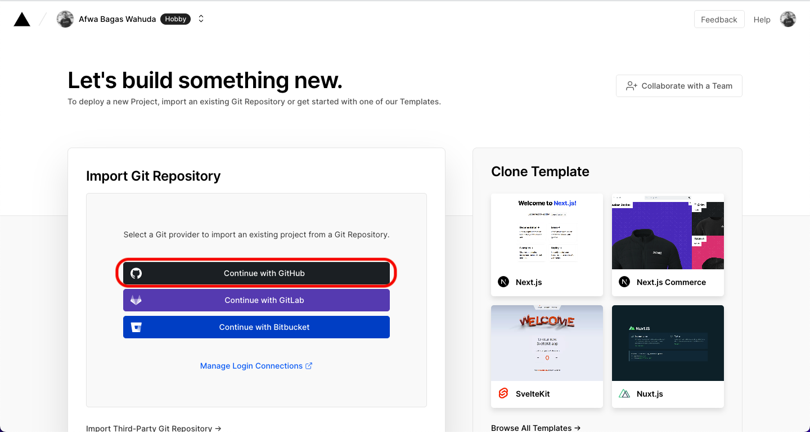
4. Klik tombol **Import** pada repository yang akan dideploy
   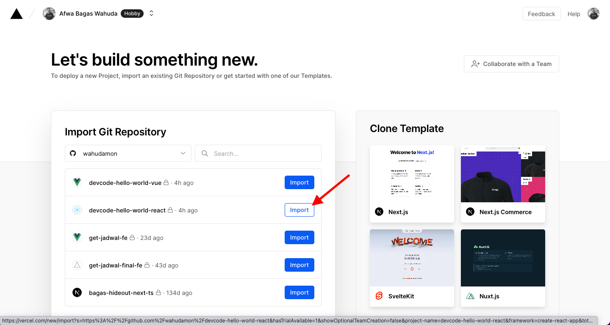
5. Klik tombol **Deploy** pada bagian **Configure Project**
   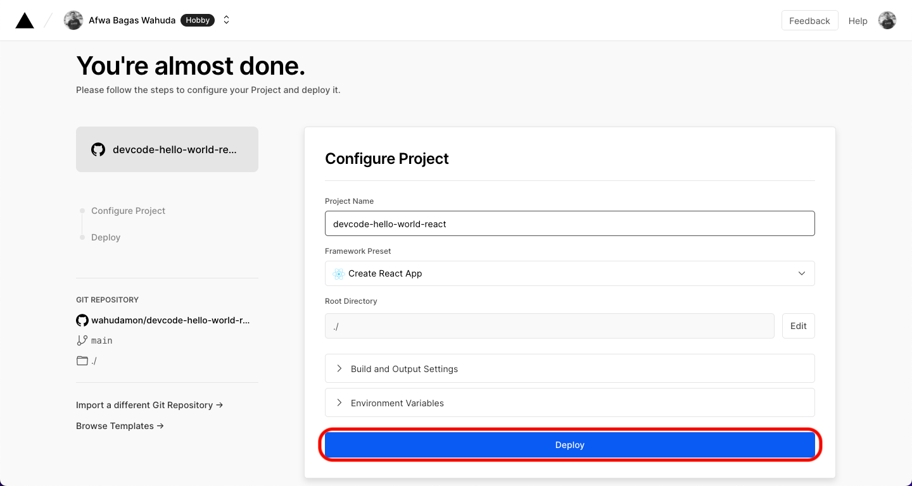
6. Tunggu proses build hingga deploy selesai
   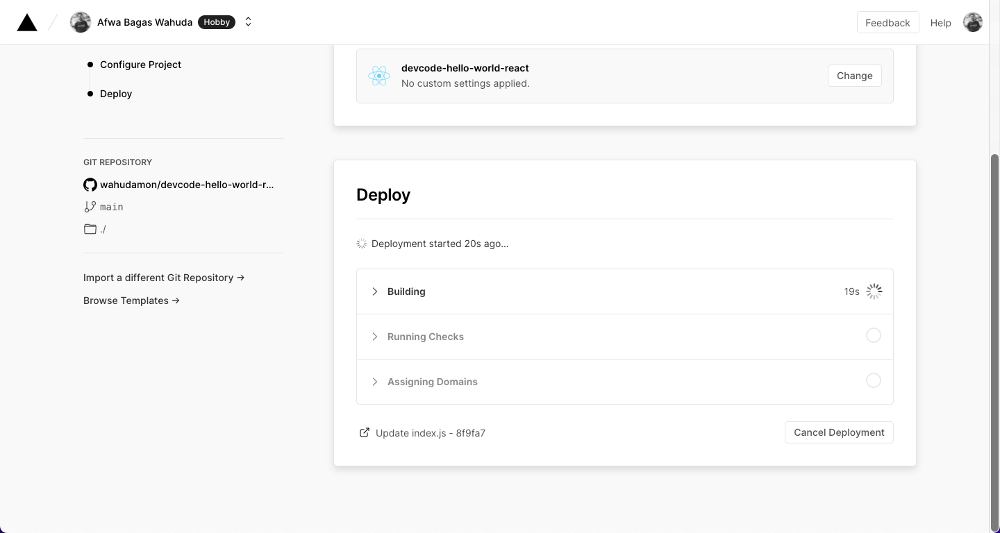
7. Jika proses deploy berhasil, akan diarahkan ke halaman success seperti pada gambar di bawah ini. Lalu klik tombol **Continue to Dashboard** pada halaman success
   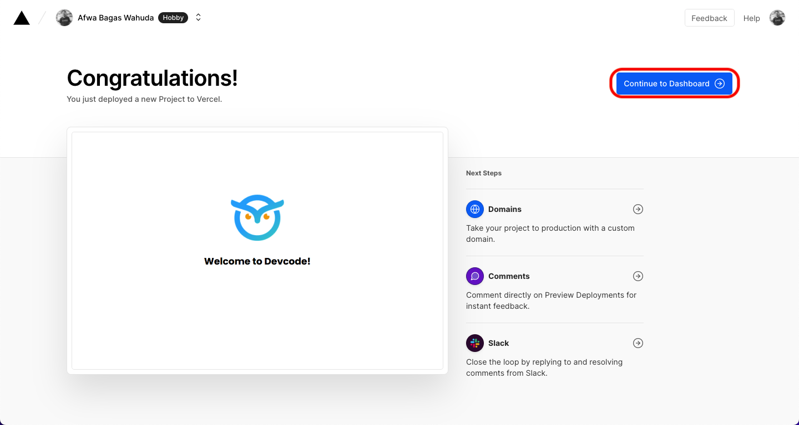
8. Klik tombol **Visit** pada halaman dashboard project untuk melihat hasil deploy
   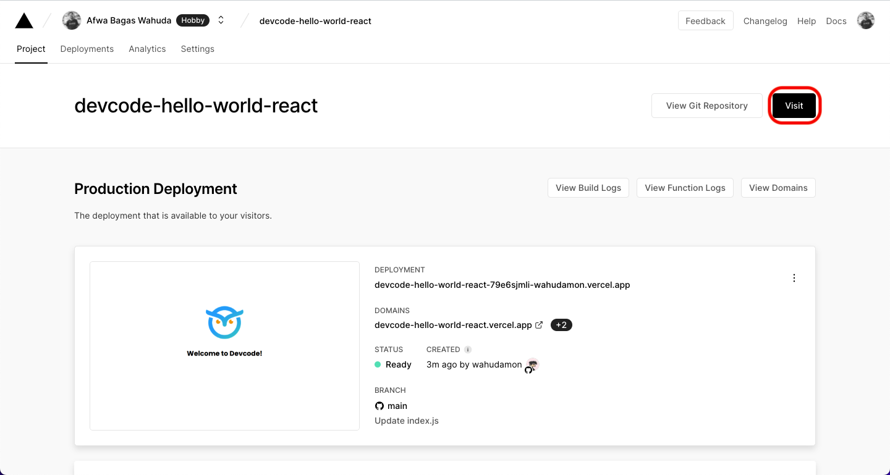
